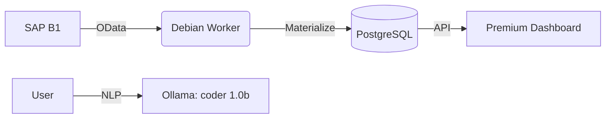

# SAP BI Hub 🚀

[🇺🇸 English](#english) | [🇪🇸 Español](#español) | [🇮🇹 Italiano](#italiano)

---

<a name="english"></a>
## 🇺🇸 English - Optimized for Debian 🐧

### 🎯 Vision & Mission
**Vision**: To be the global standard for high-performance SAP B1 data materialization.
**Mission**: Democratize SAP data using local PostgreSQL marts and AI assistance on Debian Linux.

### 🏗️ Architecture & Flow


### 📋 Summary
SAP BI Hub is a "Plug & Play" platform centered on **Debian Linux**. It extracts data from SAP Service Layer and materializes it into PostgreSQL.

### ✨ Features
- **Debian Optimized**: Native systemd services.
- **AI Query**: Coder 1.0b integration.
- **Real-time Health**: Monitor Debian stats from the dashboard.

### 🚀 Debian Installation
```bash
git clone https://github.com/LORDMANUEL/sapslayer.git
cd sapslayer
chmod +x install-debian.sh
./install-debian.sh
```

---

<a name="español"></a>
## 🇪🇸 Español - Optimizado para Debian 🐧

### 🎯 Visión y Misión
**Visión**: Ser el estándar global para la materialización de datos de SAP B1 de alto rendimiento.
**Misión**: Democratizar los datos de SAP utilizando marts locales de PostgreSQL y asistencia de IA en Debian Linux.

### 📋 Resumen
SAP BI Hub es una plataforma "Plug & Play" centrada en **Debian Linux**. Extrae datos de SAP Service Layer y los materializa en PostgreSQL.

### 🚀 Instalación en Debian
```bash
git clone https://github.com/LORDMANUEL/sapslayer.git
cd sapslayer
chmod +x install-debian.sh
./install-debian.sh
```

---

<a name="italiano"></a>
## 🇮🇹 Italiano - Ottimizzato per Debian 🐧

### 📋 Riassunto
SAP BI Hub è una piattaforma "Plug & Play" focalizzata su **Debian Linux**. Estrae i dati dal SAP Service Layer e li materializza in PostgreSQL.

### 🚀 Installazione su Debian
```bash
git clone https://github.com/LORDMANUEL/sapslayer.git
cd sapslayer
chmod +x install-debian.sh
./install-debian.sh
```
