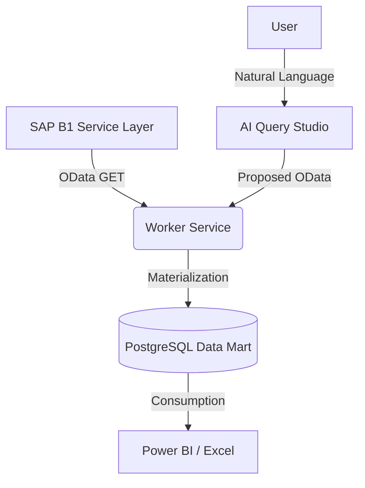
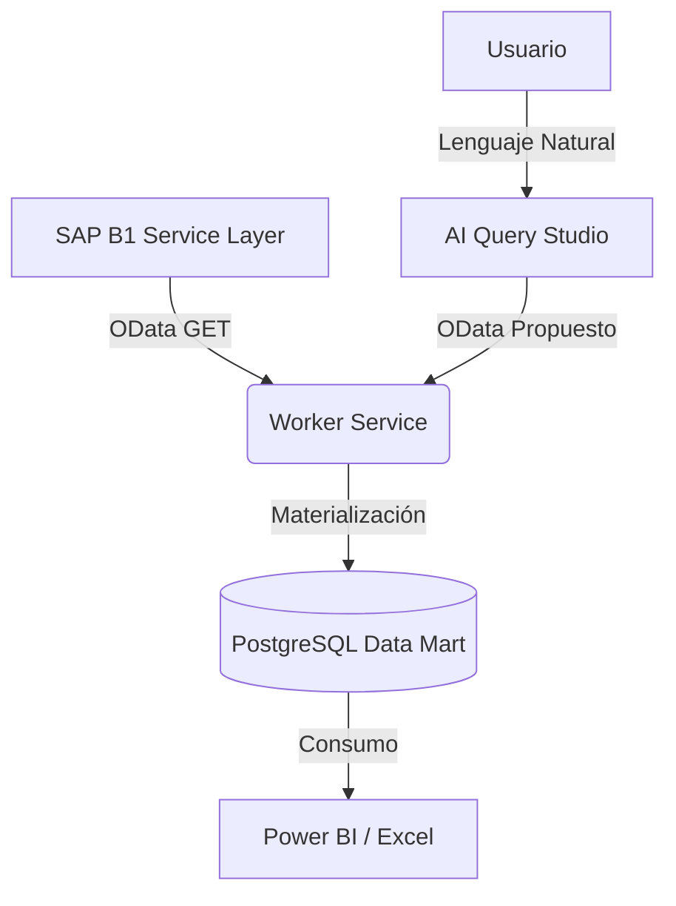
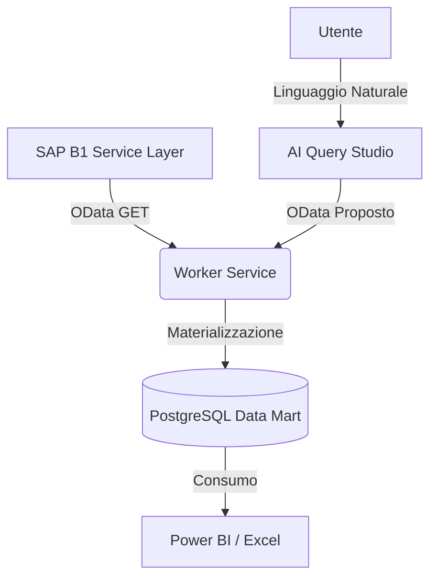

# SAP BI Hub 🚀

[🇺🇸 English](#english) | [🇪🇸 Español](#español) | [🇮🇹 Italiano](#italiano)

---

## 🇺🇸 English

### 👁️ Vision
To be the standard local platform for real-time SAP Business One data democratization and AI-driven business intelligence.

### 🎯 Mission
Provide a high-performance, secure, and plug-and-play solution that materializes SAP OData into actionable datasets without compromising ERP stability.

### 📌 Objective
Enable data engineers and analysts to build complex BI models using local PostgreSQL materialization and AI assistance, reducing SAP Service Layer latency and operational impact.

### 🏗️ Architecture & Flow

### 📋 Summary
SAP BI Hub is a middle-tier platform that fetches data from SAP B1 via OData, normalizes it, and saves it into local PostgreSQL tables (`ds_*`). This allows for sub-second query performance and advanced AI-assisted data modeling.

### ✨ Features
- **ETL Motor**: Scheduled and manual materialization.
- **AI Assistant**: Powered by `coder 1.0b` via Ollama.
- **Power BI Connectors**: CSV/JSON and direct DB access.
- **RBAC**: Security roles compliant with ISO 27001.

### ⚙️ Installation
1. **Prerequisites**: .NET 8, PostgreSQL 15, Ollama (`coder 1.0b`).
2. **Setup**: Run `.\install-windows.ps1` or `./install-debian.sh`.

### 🛠️ Troubleshooting & Validation
- **Problem**: Connection refused to SAP.
  - *Fix*: Check Service Layer URL and SSL certificate.
- **Validation**: Check `QueryRuns` table for execution status and row counts.

---

## 🇪🇸 Español

### 👁️ Visión
Ser la plataforma local estándar para la democratización de datos de SAP Business One en tiempo real e inteligencia de negocios impulsada por IA.

### 🎯 Misión
Proporcionar una solución plug-and-play, segura y de alto rendimiento que materialice OData de SAP en conjuntos de datos accionables sin comprometer la estabilidad del ERP.

### 📌 Objetivo
Permitir que los ingenieros de datos y analistas construyan modelos de BI complejos utilizando materialización local en PostgreSQL y asistencia de IA, reduciendo la latencia de SAP Service Layer y el impacto operativo.

### 🏗️ Arquitectura y Flujo

### 📋 Resumen
SAP BI Hub es una plataforma de nivel intermedio que obtiene datos de SAP B1 a través de OData, los normaliza y los guarda en tablas locales de PostgreSQL (`ds_*`). Esto permite un rendimiento de consulta de milisegundos y un modelado de datos avanzado asistido por IA.

### ✨ Características
- **Motor ETL**: Materialización programada y manual.
- **Asistente de IA**: Impulsado por `coder 1.0b` vía Ollama.
- **Conectores Power BI**: CSV/JSON y acceso directo a la BD.
- **RBAC**: Roles de seguridad compatibles con ISO 27001.

### ⚙️ Instalación
1. **Requisitos**: .NET 8, PostgreSQL 15, Ollama (`coder 1.0b`).
2. **Configuración**: Ejecuta `.\install-windows.ps1` o `./install-debian.sh`.

### 🛠️ Problemas y Validación
- **Problema**: Conexión rechazada a SAP.
  - *Solución*: Verifique la URL de Service Layer y el certificado SSL.
- **Validación**: Revise la tabla `QueryRuns` para ver el estado de ejecución y el conteo de filas.

---

## 🇮🇹 Italiano

### 👁️ Visione
Essere la piattaforma locale standard per la democratizzazione dei dati SAP Business One in tempo reale e la business intelligence guidata dall'IA.

### 🎯 Missione
Fornire una soluzione plug-and-play, sicura e ad alte prestazioni che materializzi OData SAP in dataset azionabili senza compromettere la stabilità dell'ERP.

### 📌 Obiettivo
Consentire a data engineer e analisti di creare modelli BI complessi utilizzando la materializzazione PostgreSQL locale e l'assistenza dell'IA, riducendo la latenza del SAP Service Layer e l'impatto operativo.

### 🏗️ Architettura e Flusso

### 📋 Riassunto
SAP BI Hub è una piattaforma di livello intermedio che recupera dati da SAP B1 tramite OData, li normalizza e li salva in tabelle PostgreSQL locali (`ds_*`). Ciò consente prestazioni di query inferiori al secondo e una modellazione dei dati avanzata assistita dall'IA.

### ✨ Caratteristiche
- **Motore ETL**: Materializzazione programmata e manual.
- **Assistente AI**: Alimentato da `coder 1.0b` tramite Ollama.
- **Connettori Power BI**: CSV/JSON e accesso diretto al DB.
- **RBAC**: Ruoli di sicurezza conformi a ISO 27001.

### ⚙️ Installazione
1. **Requisiti**: .NET 8, PostgreSQL 15, Ollama (`coder 1.0b`).
2. **Configurazione**: Esegui `.\install-windows.ps1` o `./install-debian.sh`.

### 🛠️ Problemi e Validazione
- **Problema**: Connessione rifiutata a SAP.
  - *Soluzione*: Controllare l'URL del Service Layer e il certificato SSL.
- **Validazione**: Controllare la tabella `QueryRuns` per lo stato di esecuzione e il conteggio delle righe.
